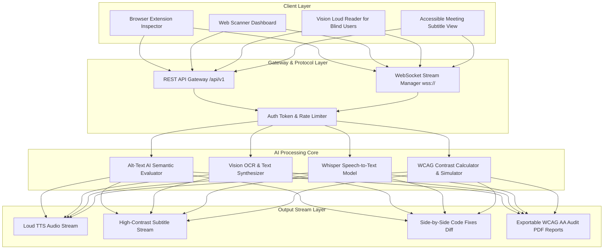

# AccessAI ♿🤖

> **Next-Generation AI Web Accessibility Scanner & Real-Time Inclusive Meeting Platform**

[](https://react.dev/)
[](https://vitejs.dev/)
[](https://tailwindcss.com/)
[](https://www.w3.org/WAI/standards-guidelines/wcag/)
[](LICENSE)

AccessAI is an AI-powered web accessibility platform that evaluates whether accessibility fixes are **meaningful and usable** for people with disabilities, going beyond traditional rule-based checkers that only verify syntax presence.

It pairs an **AI Web Accessibility Scanner** with a **Vision AI Loud Reader** for blind users and a **Zero-Install Real-Time Accessible Meeting Tool** for deaf users with live Whisper speech transcription.

---

## 🌟 Key Features & Modules

### 1. ⚡ AI Web Accessibility Scanner & Evaluator
* **Contextual Alt-Text Evaluation**: Distinguishes generic attributes (`alt="photo.jpg"`) from meaningful descriptions, flagging useless tags and generating semantic alternatives.
* **Color Vision Deficiency Simulator**: Live UI filter simulation for **Deuteranopia**, **Protanopia**, **Tritanopia**, and **Achromatopsia**.
* **WCAG AA/AAA Contrast Ratio Calculator**: Calculates contrast ratios against 4.5:1 and 7.0:1 thresholds with automated high-contrast palette suggestions.
* **DOM Heading Structure Inspector**: Visualizes outline hierarchy (H1 -> H2 -> H3) and alerts developers to skipped heading levels.
* **Side-by-Side Code Remediation**: Shows original code alongside AI-remediated accessible code with 1-click copy.

### 2. 👁️ Vision AI Loud Reader & Audio Explainer (For Blind & Low-Vision Users)
* **Multi-Source Image Input**: Drag-and-drop file upload, camera snapshot, or pre-loaded test samples (medical prescriptions, utility bills, street signs, invoices).
* **AI OCR & Context Synthesizer**: Extracts text and synthesizes plain-language explanations of complex visual layouts.
* **Loud Text-to-Speech (TTS) Reader**: Built-in speech synthesis with rate controls (0.75x–2.0x), voice accent picker, HTML5 canvas audio wave animation, and transcript viewer.

### 3. 🎙️ Real-Time Accessible Meeting Tool (For Deaf & Hard-of-Hearing Users)
* **Live Speech-to-Text Transcriber**: Continuous live captions powered by Web Speech API and simulated OpenAI Whisper engine stream.
* **Zero-Install / 100% Web-Based**: Runs in any browser link (Chrome, Safari, Edge, Firefox, iOS/Android) without installing heavy desktop apps.
* **Deaf-Inclusive UI Controls**: High-contrast Yellow-on-Black overlay mode, OpenDyslexic font support, scalable caption typography (16px to 32px), and speaker diarization.
* **Live AI Meeting Summary**: Auto-generates real-time meeting notes and key takeaways during speech.

### 4. 🛠️ Developer API & Extension Sandbox
* **Simulated Browser Extension Overlay**: Floating widget overlay to inspect target DOM elements on live mock pages.
* **Interactive REST & WebSocket API Sandbox**: Playground for testing `/api/v1/scan/url`, `/api/v1/vision/read-explain`, and `wss://stream.accessai.io/v1/meetings/transcribe` with cURL & Node.js SDK code snippets.
* **Compliance Audit Exporter**: Generates exportable WCAG 2.1/2.2 AA PDF, HTML, and JSON audit reports.

---

## 🏗️ System Architecture



---

## 🚀 Getting Started

### Prerequisites
* Node.js (v18.0.0 or higher)
* npm (v9.0.0 or higher)

### Installation & Local Setup

```bash
# 1. Clone the repository
git clone https://github.com/diyaapoulkar-alt/AccessAI.git

# 2. Navigate into the project directory
cd AccessAI

# 3. Install dependencies
npm install

# 4. Start the local development server
npm run dev
```

Open your browser and navigate to `http://localhost:5173/` to view the running application.

### Building for Production

```bash
npm run build
```

---

## 📁 Repository Structure

```
AccessAI/
├── index.html
├── vite.config.js
├── tailwind.config.js
├── package.json
├── README.md
├── src/
│   ├── main.jsx
│   ├── App.jsx
│   ├── index.css
│   ├── components/
│   │   ├── Navbar.jsx
│   │   ├── Scanner/
│   │   │   └── ScannerDashboard.jsx
│   │   ├── VisionReader/
│   │   │   └── VisionLoudReader.jsx
│   │   ├── Meeting/
│   │   │   └── MeetingRoom.jsx
│   │   ├── Extension/
│   │   │   └── ExtensionOverlay.jsx
│   │   ├── ApiSandbox/
│   │   │   └── ApiPlayground.jsx
│   │   └── Presentation/
│   │       ├── GammaPromptGenerator.jsx
│   │       └── ArchitectureDiagrams.jsx
│   ├── data/
│   │   ├── mockScanData.js
│   │   ├── sampleVisionData.js
│   │   └── apiExamples.js
│   └── utils/
│       ├── contrastChecker.js
│       ├── ttsEngine.js
│       └── sttEngine.js
```

---

## 👥 Team & Contributions

| S.No. | Member | Project Role | Major Technical Contribution |
| :---: | :--- | :--- | :--- |
| **1** | **Diyaa Poulkar** | **AI Core, Vision & Backend Systems Developer** | Vision AI Loud Reader (OCR + TTS), Whisper speech-to-text live meeting tool, REST & WebSocket API Gateway. |
| **2** | **Team Member 2** | **AI/ML Alt-Text & WCAG Evaluation Specialist** | Alt-text AI evaluator, DOM heading structure inspector, WCAG 2.1/2.2 AA rule auditor. |
| **3** | **Team Member 3** | **UI/UX & Color Vision Accessibility Specialist** | Color vision deficiency simulator, WCAG contrast calculator, High-Contrast Yellow/Black & OpenDyslexic UI modes. |
| **4** | **Team Member 4** | **Frontend & Browser Extension Engineer** | Core React 18 layout, floating Chrome extension overlay inspector, split-screen meeting view. |
| **5** | **Team Member 5** | **QA, Exporter & Documentation Engineer** | Downloadable PDF/JSON audit report exporters, cross-browser testing, system documentation. |

---

## 📜 Standards & References
* [W3C Web Content Accessibility Guidelines (WCAG 2.1 & 2.2)](https://www.w3.org/TR/WCAG21/)
* [W3C Web Speech API Specification](https://w3c.github.io/speech-api/)
* [OpenAI Whisper Paper (Radford et al.)](https://arxiv.org/abs/2212.04356)
* [Chrome DevTools Accessibility Auditing Guidelines](https://developer.chrome.com/docs/devtools/accessibility/)

---

## 📄 License
This project is licensed under the MIT License - see the [LICENSE](LICENSE) file for details.
