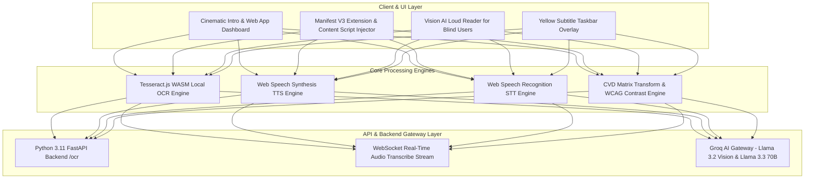

# AccessAI ♿🤖

> **Next-Generation AI Web Accessibility Suite, WASM OCR Vision Reader & Real-Time Inclusive Subtitle Platform**

[](https://react.dev/)
[](https://vitejs.dev/)
[](https://tailwindcss.com/)
[](https://tesseract.projectnaptha.com/)
[](https://www.w3.org/WAI/standards-guidelines/wcag/)
[](LICENSE)

AccessAI is an end-to-end AI-powered web accessibility platform and browser extension ecosystem designed to bridge accessibility barriers for blind/visually impaired, deaf/hard-of-hearing, and color-blind or dyslexic users. It evaluates whether web elements are **meaningful, usable, and compliant** with **WCAG 2.1/2.2 AA standards**.

---

## 🌟 Key Features & Modules

### 1. 👁️ Vision AI OCR Loud Reader (Blind & Low-Vision UX)
* **Multi-Tiered Fail-Safe OCR Pipeline**:
  1. **Tier 1**: Local Python FastAPI OCR Backend (`/ocr`).
  2. **Tier 2**: **Tesseract.js WebAssembly (WASM)** client-side engine (decodes uncompressed image blobs locally in the browser with 100% offline reliability).
  3. **Tier 3**: **Llama 3.2 11B Vision** AI model.
* **Natural Speech Synthesis (TTS)**: Built-in Web Speech Synthesis engine with **250ms sentence breathing pauses**, abbreviation normalization (e.g. converting `1.Def:` → `"Point 1. Definition:"`), taskbar noise filtering, rate controls, and canvas audio waveform visualizers.

### 2. 🎙️ Chrome Extension & Google Meet Live Subtitles (Deaf & Hard-of-Hearing UX)
* **Manifest V3 Extension Architecture**: Built with background service workers, content script DOM injection (`content.js`), floating drawer widget dock (`MeetExtensionWidget.jsx`), and yellow subtitle taskbar overlay.
* **Live Speech-to-Text (STT) & Diarization**: Real-time continuous speech transcription with speaker diarization (`You (Microphone)`, `Host`, `Presenter`), continuous auto-reconnection loop, and live mic override priority over simulation.
* **Deaf-Inclusive UI Controls**: High-contrast Yellow-on-Black overlay taskbar, OpenDyslexic typography support, scalable caption typography, and 1-click clean DOM node purging (`✕ Close`).

### 3. 🎨 Color Vision Deficiency (CVD) Simulator
* **Live Vision Matrix Simulation**: Real-time matrix color transformation filters simulating **Deuteranopia**, **Protanopia**, **Tritanopia**, and **Achromatopsia** using Brettel and Machado matrix algorithms.

### 4. 🛡️ WCAG 2.1/2.2 AA Contrast & Palette Generator
* **Compliance Luminance Engine**: Calculates relative contrast ratios against 4.5:1 (AA) and 7.0:1 (AAA) thresholds using piecewise sRGB companding and alpha compositing, with automated HSL compliant palette generation.

### 5. 🔍 AI Alt-Text Evaluator & DOM Inspector
* **Contextual Image Alt-Text Review**: Evaluates alt-text quality, flags generic attributes (`alt="photo.jpg"`), and generates semantic alt-text using Llama 3.3 70B.
* **In-Page DOM Inspector**: Inspects target DOM elements for missing accessibility attributes, unlabeled controls, and skipped heading levels.

### 6. ⚡ REST & WebSocket API Gateway Sandbox
* **Interactive API Playground**: Developer sandbox for testing endpoints `/api/v1/vision/read-explain`, `/api/v1/scan/url`, `/ocr`, and real-time audio WebSocket streams with cURL and JavaScript code snippets.
* **Compliance Audit Exporter**: Generates exportable WCAG 2.1/2.2 AA audit reports in PDF, HTML, and JSON formats.

---

## 🏗️ System Architecture



---

## 💻 Tech Stack & Frameworks

| Domain | Framework / Library | Role |
| :--- | :--- | :--- |
| **Frontend UI** | **React 18, Vite 8, Tailwind CSS** | Fast Single Page Application (SPA), warm brown/porcelain white luxury theme, custom keyframe animations |
| **Browser Extension** | **Chrome Extension Manifest V3** | Service worker (`background.js`), DOM content script injection (`content.js`), floating drawer widget |
| **Client WASM Engine**| **Tesseract.js (WebAssembly)** | Local browser WASM OCR text extraction from image Blobs |
| **AI Vision & LLM** | **Llama 3.2 11B Vision & Llama 3.3 70B** | Multilingual text simplification and visual scene description via Groq API |
| **Audio Synthesis** | **Web Speech API (TTS & STT)** | Natural SpeechSynthesis with sentence pause cadence and SpeechRecognition STT |
| **Backend Service** | **Python 3.11, FastAPI, Uvicorn** | REST API endpoints (`/ocr`, `/evaluate-alt-text`, `/transcribe`) |
| **Icons & Typography**| **Lucide Icons, Plus Jakarta Sans, Atkinson Hyperlegible** | Accessible iconography and dyslexic-friendly typography |

---

## 👥 Team & Individual Technical Contributions

| S.No. | Member Name | Registration No. | Project Role | Major Technical Contribution |
| :---: | :--- | :--- | :--- | :--- |
| **1** | **Diya Annasaheb Poulkar** | **25BCE11424** | **Real-Time Audio & AI Systems Architect** | Designed & built the entire React + Vite UI layout, white & warm brown aesthetic, and site opening intro animation (with custom geometric A logo); architected the Chrome Extension (Manifest V3, background service worker, content script DOM injection, floating drawer widget, and yellow subtitle taskbar UI); built the Vision AI Loud Reader OCR & TTS engine (Tesseract.js WASM + Llama 3.2 Vision fallback, abbreviation normalization like `1.Def:` → `"Point 1. Definition:"`, and 250ms sentence pauses); built the `sttEngine.js` continuous STT speech recognition & diarization engine. |
| **2** | **Diya Payal** | **25BCE11416** | **Accessibility & AI Engine Specialist** | AI alt-text context evaluator, Vision OCR prompt templates, document AI context explainer. |
| **3** | **Eshaan Dogra** | **25BCE10675** | **UX/UI & Compliance Specialist** | Color Vision Deficiency Simulator (Deuteranopia, Protanopia, Tritanopia, Achromatopsia matrices), WCAG AA/AAA contrast calculator, High-Contrast Yellow/Black & OpenDyslexic UI modes. |
| **4** | **Ayushi Gupta** | **25BCE11169** | **AI Vision & Speech Synthesis Developer** | Backend WebSocket stream handler connection for real-time audio transcription, split-screen meeting view & audio visualizer canvas integration. |
| **5** | **Kunwar Singh** | **25BCE11021** | **Integration / Testing Developer** | Developer REST & WebSocket API Gateway Sandbox, compliance audit PDF/JSON report exporters. |

---

## 🚀 Installation & Local Setup

### Prerequisites
* **Node.js**: v18.x or higher
* **npm**: v9.x or higher
* **Python**: v3.11+ (optional for backend endpoints)

### 1. Clone & Install Dependencies
```bash
git clone https://github.com/diyaapoulkar-alt/AccessAI.git
cd AccessAI
npm install
```

### 2. Start Development Server
```bash
npm run dev
```
Open [http://localhost:5178/](http://localhost:5178/) in your browser.

### 3. Load Chrome Extension
1. Open Chrome and navigate to `chrome://extensions/`.
2. Enable **Developer Mode** (top-right toggle).
3. Click **Load Unpacked** and select `public/extension` (or `dist/extension`).

---

## 📜 Standards & References
* [W3C Web Content Accessibility Guidelines (WCAG 2.1 & 2.2)](https://www.w3.org/TR/WCAG21/)
* [W3C Web Speech API Specification](https://w3c.github.io/speech-api/)
* [Tesseract.js WebAssembly OCR Engine](https://tesseract.projectnaptha.com/)
* [Chrome DevTools Accessibility Auditing Guidelines](https://developer.chrome.com/docs/devtools/accessibility/)

---

## 📄 License
This project is licensed under the MIT License - see the [LICENSE](LICENSE) file for details.
